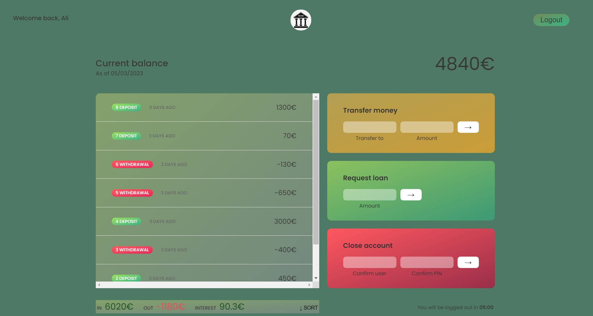
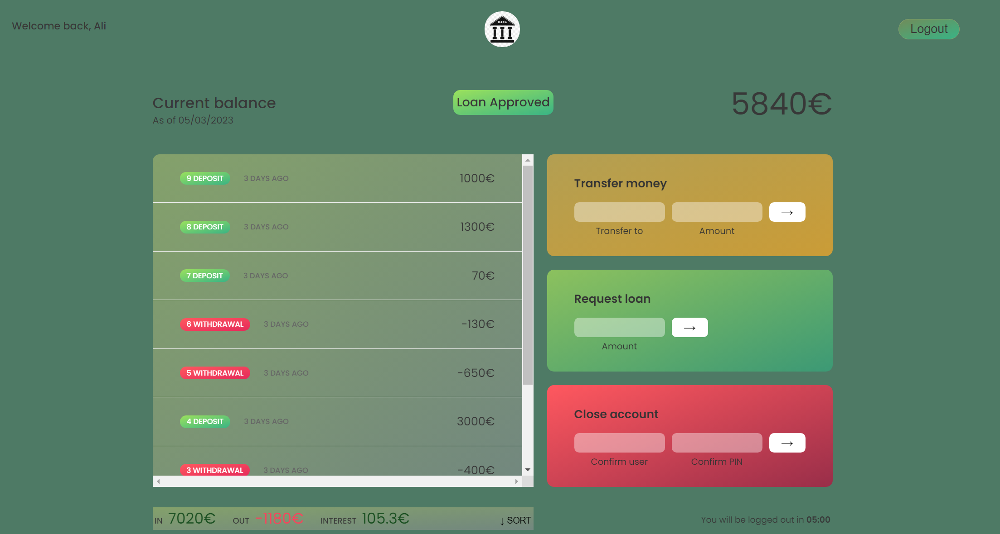

# BankApp 🏦

A lightweight, user-friendly banking application built with vanilla JavaScript, HTML, and CSS. Perform essential banking operations securely and effortlessly.

---

## 📋 Features

- **🔐 Secure Login** – Securely access your account with authentication
- **💸 Fund Transfer** – Transfer money between accounts with ease
- **🔄 Switch Accounts** – Seamlessly switch between different accounts
- **💳 Withdraw & Deposit** – Perform quick withdrawals and deposits
- **📊 Account Details** – View your account information at a glance

---

## 🎨 Screenshots

| Login Screen | Account Dashboard | Transfer Funds |
|---|---|---|
|  |  |  |

---

## 🛠️ Tech Stack

| Technology | Usage |
|---|---|
|  | Structure & Markup (34.5%) |
|  | Styling & Layout (34.4%) |
|  | Logic & Interactivity (31.1%) |

---

## 🚀 Quick Start

### Installation

1. Clone the repository:
```bash
git clone https://github.com/AAliasghar/BankApp.git
cd BankApp
```

2. Open the application:
   - Simply open `index.html` in your web browser
   - No dependencies or build process required!

### Usage

1. **Login** – Enter your credentials to access your account
2. **Manage Funds** – Perform transfers, deposits, or withdrawals
3. **View Details** – Check your current account balance and transaction history

---

## 📁 Project Structure

```
BankApp/
├── index.html           # Main application file
├── styles.css           # Application styling
├── script.js            # Core application logic
├── Login.png            # Login screen screenshot
├── Account.png          # Account dashboard screenshot
├── Account_transfer.png # Transfer interface screenshot
└── README.md            # This file
```

---

## ✨ Key Highlights

- **Lightweight** – Minimal codebase with no external dependencies
- **Fast Performance** – Instant loading and smooth interactions
- **Intuitive UI** – User-friendly interface designed for simplicity
- **Responsive Design** – Works seamlessly on different screen sizes
- **Vanilla JavaScript** – Pure JavaScript without frameworks

---

## 📝 License

This project is open-source. Feel free to use, modify, and distribute as needed.

---

## 👤 Author

Created by **AAliasghar**

- GitHub: [@AAliasghar](https://github.com/AAliasghar)
- Repository: [BankApp](https://github.com/AAliasghar/BankApp)

---

## 📞 Support

If you encounter any issues or have suggestions, feel free to open an issue on the [GitHub repository](https://github.com/AAliasghar/BankApp/issues).

---

**Last Updated:** June 2024
